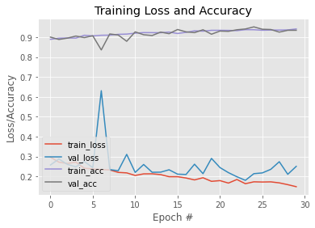
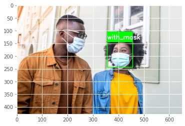
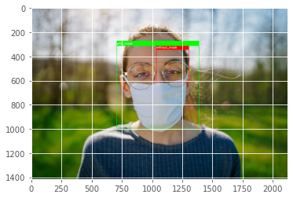

# Face-Mask-Detection
Image classification model to detect Face Masks

Consider the dataset that was created with the objective of facilitating the studies of convolutional neural networks and computer vision.
Due to the current context related to the coronavirus pandemic, humanity had to adapt to the new reality. The use of face masks has become commonplace in countries around the world.
The dataset has 3829 images separated into two distinct categories:
- With mask
- Without mask

Use this dataset to implement an image classification model, which will classify whether the given image is with the mask or without the mask.


### Importing Libraries


```python
import os
import zipfile
import random
import shutil
import tensorflow as tf
from tensorflow.keras.optimizers import RMSprop
from tensorflow.keras.preprocessing.image import ImageDataGenerator
from shutil import copyfile
from os import getcwd
from os import listdir
import cv2
from tensorflow.keras.layers import Conv2D, Input, ZeroPadding2D, BatchNormalization, Activation, MaxPooling2D, Flatten, Dense
from tensorflow.keras.models import Model, load_model
from tensorflow.keras.callbacks import TensorBoard, ModelCheckpoint
from sklearn.model_selection import train_test_split
from sklearn.metrics import f1_score
from sklearn.utils import shuffle
import imutils
import numpy as np
import matplotlib.pyplot as plt
import matplotlib.image  as mpimg
```

### Analysing Files in directories


```python
print("The number of images with facemask labelling 'with_mask':",len(os.listdir('dataset/train/with_mask')))
print("The number of images with facemask labelling 'without_mask':",len(os.listdir('dataset/train/without_mask/')))
```

    The number of images with facemask labelling 'with_mask': 1526
    The number of images with facemask labelling 'without_mask': 1538
    

### Analysing Training and Test sets


```python
print("The number of images with facemask in the training set labelled 'yes':", len(os.listdir('dataset/train/with_mask')))
print("The number of images with facemask in the test set labelled 'yes':", len(os.listdir('dataset/test/with_mask')))
print("The number of images without facemask in the training set labelled 'no':", len(os.listdir('dataset/train/without_mask')))
print("The number of images without facemask in the test set labelled 'no':", len(os.listdir('dataset/test/without_mask')))
```

    The number of images with facemask in the training set labelled 'yes': 1526
    The number of images with facemask in the test set labelled 'yes': 380
    The number of images without facemask in the training set labelled 'no': 1538
    The number of images without facemask in the test set labelled 'no': 380
    

### Compiling the model


```python
model = tf.keras.models.Sequential([
    tf.keras.layers.Conv2D(100, (3,3), activation='relu', input_shape=(150, 150, 3)),
    tf.keras.layers.MaxPooling2D(2,2),
    
    tf.keras.layers.Conv2D(100, (3,3), activation='relu'),
    tf.keras.layers.MaxPooling2D(2,2),
    
    tf.keras.layers.Flatten(),
    tf.keras.layers.Dropout(0.5),
    tf.keras.layers.Dense(50, activation='relu'),
    tf.keras.layers.Dense(2, activation='softmax')
])
model.compile(optimizer='adam', loss='binary_crossentropy', metrics=['acc'])
```

### Configuring the model parameters


```python
TRAINING_DIR = "dataset/train"
train_datagen = ImageDataGenerator(rescale=1.0/255,
                                   rotation_range=40,
                                   width_shift_range=0.2,
                                   height_shift_range=0.2,
                                   shear_range=0.2,
                                   zoom_range=0.2,
                                   horizontal_flip=True,
                                   fill_mode='nearest')

train_generator = train_datagen.flow_from_directory(TRAINING_DIR, 
                                                    batch_size=10, 
                                                    target_size=(150, 150))
VALIDATION_DIR = "dataset/test"
validation_datagen = ImageDataGenerator(rescale=1.0/255)

validation_generator = validation_datagen.flow_from_directory(VALIDATION_DIR, 
                                                         batch_size=10, 
                                                         target_size=(150, 150))
checkpoint = ModelCheckpoint('model-{epoch:03d}.model',monitor='val_loss',verbose=0,save_best_only=True,mode='auto')
```

    Found 3064 images belonging to 2 classes.
    Found 760 images belonging to 2 classes.
    

### Building the classification model  


```python
history = model.fit_generator(train_generator,
                              epochs=30,
                              validation_data=validation_generator,
                              callbacks=[checkpoint])
```

    Epoch 1/30
    264/307 [========================>.....] - ETA: 7s - loss: 0.2753 - acc: 0.8967

    C:\Users\Pawan\.conda\envs\Deep Learning\lib\site-packages\PIL\Image.py:975: UserWarning: Palette images with Transparency expressed in bytes should be converted to RGBA images
      warnings.warn(
    

    307/307 [==============================] - ETA: 0s - loss: 0.2971 - acc: 0.8887INFO:tensorflow:Assets written to: model-001.model\assets
    307/307 [==============================] - 61s 198ms/step - loss: 0.2971 - acc: 0.8887 - val_loss: 0.2578 - val_acc: 0.9000
    Epoch 2/30
    307/307 [==============================] - 59s 193ms/step - loss: 0.2719 - acc: 0.8946 - val_loss: 0.2878 - val_acc: 0.8882
    Epoch 3/30
    307/307 [==============================] - 61s 197ms/step - loss: 0.2654 - acc: 0.8956 - val_loss: 0.2608 - val_acc: 0.8947
    Epoch 4/30
    307/307 [==============================] - ETA: 0s - loss: 0.2718 - acc: 0.8949INFO:tensorflow:Assets written to: model-004.model\assets
    307/307 [==============================] - 61s 199ms/step - loss: 0.2718 - acc: 0.8949 - val_loss: 0.2487 - val_acc: 0.9053
    Epoch 5/30
    307/307 [==============================] - 60s 195ms/step - loss: 0.2415 - acc: 0.9093 - val_loss: 0.2749 - val_acc: 0.8974
    Epoch 6/30
    307/307 [==============================] - ETA: 0s - loss: 0.2376 - acc: 0.9060INFO:tensorflow:Assets written to: model-006.model\assets
    307/307 [==============================] - 61s 198ms/step - loss: 0.2376 - acc: 0.9060 - val_loss: 0.2448 - val_acc: 0.9066
    Epoch 7/30
    307/307 [==============================] - 60s 194ms/step - loss: 0.2348 - acc: 0.9093 - val_loss: 0.6308 - val_acc: 0.8355
    Epoch 8/30
    307/307 [==============================] - ETA: 0s - loss: 0.2330 - acc: 0.9099INFO:tensorflow:Assets written to: model-008.model\assets
    307/307 [==============================] - 61s 198ms/step - loss: 0.2330 - acc: 0.9099 - val_loss: 0.2345 - val_acc: 0.9158
    Epoch 9/30
    307/307 [==============================] - ETA: 0s - loss: 0.2205 - acc: 0.9138INFO:tensorflow:Assets written to: model-009.model\assets
    307/307 [==============================] - 61s 199ms/step - loss: 0.2205 - acc: 0.9138 - val_loss: 0.2290 - val_acc: 0.9105
    Epoch 10/30
    307/307 [==============================] - 61s 198ms/step - loss: 0.2180 - acc: 0.9151 - val_loss: 0.3110 - val_acc: 0.8789
    Epoch 11/30
    307/307 [==============================] - ETA: 0s - loss: 0.2053 - acc: 0.9197INFO:tensorflow:Assets written to: model-011.model\assets
    307/307 [==============================] - 60s 196ms/step - loss: 0.2053 - acc: 0.9197 - val_loss: 0.2205 - val_acc: 0.9263
    Epoch 12/30
    307/307 [==============================] - 59s 192ms/step - loss: 0.2131 - acc: 0.9227 - val_loss: 0.2603 - val_acc: 0.9118
    Epoch 13/30
    307/307 [==============================] - 59s 192ms/step - loss: 0.2134 - acc: 0.9223 - val_loss: 0.2211 - val_acc: 0.9079
    Epoch 14/30
    307/307 [==============================] - 59s 192ms/step - loss: 0.2095 - acc: 0.9220 - val_loss: 0.2217 - val_acc: 0.9250
    Epoch 15/30
    307/307 [==============================] - 59s 192ms/step - loss: 0.1989 - acc: 0.9253 - val_loss: 0.2337 - val_acc: 0.9171
    Epoch 16/30
    307/307 [==============================] - ETA: 0s - loss: 0.1988 - acc: 0.9181INFO:tensorflow:Assets written to: model-016.model\assets
    307/307 [==============================] - 60s 197ms/step - loss: 0.1988 - acc: 0.9181 - val_loss: 0.2117 - val_acc: 0.9382
    Epoch 17/30
    307/307 [==============================] - ETA: 0s - loss: 0.1924 - acc: 0.9240INFO:tensorflow:Assets written to: model-017.model\assets
    307/307 [==============================] - 60s 196ms/step - loss: 0.1924 - acc: 0.9240 - val_loss: 0.2101 - val_acc: 0.9263
    Epoch 18/30
    307/307 [==============================] - 59s 192ms/step - loss: 0.1828 - acc: 0.9315 - val_loss: 0.2617 - val_acc: 0.9224
    Epoch 19/30
    307/307 [==============================] - 59s 192ms/step - loss: 0.1937 - acc: 0.9298 - val_loss: 0.2141 - val_acc: 0.9368
    Epoch 20/30
    307/307 [==============================] - 59s 192ms/step - loss: 0.1756 - acc: 0.9341 - val_loss: 0.2909 - val_acc: 0.9145
    Epoch 21/30
    307/307 [==============================] - 59s 192ms/step - loss: 0.1792 - acc: 0.9341 - val_loss: 0.2448 - val_acc: 0.9303
    Epoch 22/30
    307/307 [==============================] - 59s 191ms/step - loss: 0.1669 - acc: 0.9337 - val_loss: 0.2193 - val_acc: 0.9289
    Epoch 23/30
    307/307 [==============================] - ETA: 0s - loss: 0.1848 - acc: 0.9324INFO:tensorflow:Assets written to: model-023.model\assets
    307/307 [==============================] - 60s 196ms/step - loss: 0.1848 - acc: 0.9324 - val_loss: 0.1987 - val_acc: 0.9368
    Epoch 24/30
    307/307 [==============================] - ETA: 0s - loss: 0.1637 - acc: 0.9373INFO:tensorflow:Assets written to: model-024.model\assets
    307/307 [==============================] - 60s 196ms/step - loss: 0.1637 - acc: 0.9373 - val_loss: 0.1807 - val_acc: 0.9408
    Epoch 25/30
    307/307 [==============================] - 59s 192ms/step - loss: 0.1732 - acc: 0.9370 - val_loss: 0.2141 - val_acc: 0.9513
    Epoch 26/30
    307/307 [==============================] - 59s 192ms/step - loss: 0.1722 - acc: 0.9344 - val_loss: 0.2180 - val_acc: 0.9395
    Epoch 27/30
    307/307 [==============================] - 59s 192ms/step - loss: 0.1730 - acc: 0.9354 - val_loss: 0.2360 - val_acc: 0.9382
    Epoch 28/30
    307/307 [==============================] - 59s 192ms/step - loss: 0.1679 - acc: 0.9354 - val_loss: 0.2742 - val_acc: 0.9250
    Epoch 29/30
    307/307 [==============================] - 59s 191ms/step - loss: 0.1590 - acc: 0.9360 - val_loss: 0.2110 - val_acc: 0.9342
    Epoch 30/30
    307/307 [==============================] - 59s 191ms/step - loss: 0.1487 - acc: 0.9409 - val_loss: 0.2508 - val_acc: 0.9342
    


```python
face_clsfr=cv2.CascadeClassifier('haarcascade_frontalface_default.xml')
```


```python
model.save_weights("model.h5")
```

###  Plot the training loss and accuracy


```python
N = 30
plt.style.use("ggplot")
plt.figure()
plt.plot(np.arange(0, N), history.history["loss"], label="train_loss")
plt.plot(np.arange(0, N), history.history["val_loss"], label="val_loss")
plt.plot(np.arange(0, N), history.history["acc"], label="train_acc")
plt.plot(np.arange(0, N), history.history["val_acc"], label="val_acc")
plt.title("Training Loss and Accuracy")
plt.xlabel("Epoch #")
plt.ylabel("Loss/Accuracy")
plt.legend(loc="lower left")
```


    <matplotlib.legend.Legend at 0x203b5f80c70>


    

    


### Running the model on Test data


```python
labels_dict={0:'without_mask',1:'with_mask'}
color_dict={0:(0,0,255),1:(0,255,0)}

size = 4
webcam = cv2.VideoCapture(0) #Use camera 0

# We load the xml file
classifier = cv2.CascadeClassifier('haarcascade_frontalface_default.xml')

test_directory = 'tests'
for root, directories, file in os.walk(test_directory):
    files = file
    
for file in files:
    im = cv2.imread(os.path.join(test_directory , file))
    
    # Resize the image to speed up detection
    mini = cv2.resize(im, (im.shape[1] // size, im.shape[0] // size))

    # detect MultiScale / faces 
    faces = classifier.detectMultiScale(mini)

    # Draw rectangles around each face
    for f in faces:
        (x, y, w, h) = [v * size for v in f] #Scale the shapesize backup
        #Save just the rectangle faces in SubRecFaces
        face_img = im[y:y+h, x:x+w]
        resized=cv2.resize(face_img,(150,150))
        normalized=resized/255.0
        reshaped=np.reshape(normalized,(1,150,150,3))
        reshaped = np.vstack([reshaped])
        result=model.predict(reshaped)
        #print(result)
        
        label=np.argmax(result,axis=1)[0]
      
        cv2.rectangle(im,(x,y),(x+w,y+h),color_dict[label],2)
        cv2.rectangle(im,(x,y-40),(x+w,y),color_dict[label],-1)
        cv2.putText(im, labels_dict[label], (x, y-10),cv2.FONT_HERSHEY_SIMPLEX,0.8,(255,255,255),2)
        cv2.imwrite(os.path.join(os.getcwd()+'output')+str('output_'+file+'.jpg'), im)
 
```

### Importing the saved output files to view output images 


```python
import glob
imdir = "output"
ext = ['jpg']    

files = []
[files.extend(glob.glob(imdir + '*.' + e)) for e in ext]

images = [cv2.imread(file) for file in files]

for image in images:
  
    image = cv2.cvtColor(image, cv2.COLOR_BGR2RGB)
    plt.imshow(image)
    plt.show()

```


    

    


    

    

